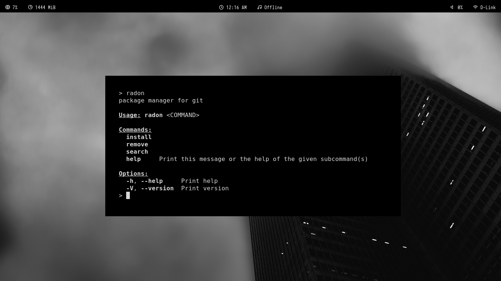

# Radon

Package manager for git

## Description

Radon is a package manager for git projects built in rust that compiles from source



## Installation

```
git clone https://github.com/tungstencube-git/radon
cd radon
cargo build --release
sudo (or doas) cp target/release/radon /usr/local/bin (/usr/bin if local/bin is not in path, echo $PATH to check)

```

## Contributing

See [CONTRIBUTING.md](./CONTRIBUTING.md).

## General Tips

- **Install directory**: Radon installs to /usr/local/bin if in PATH if not in path falls back to /usr/bin if you install a package with radon but get a command not found error run "ls /usr/local/bin | grep radon"

- **Removing packages**: The removing function is currently very primitive, it stores installed packages at /etc/radon/listinstalled if the previously mentioned file is removed radon wont be aware of installed packages

- **Distinguishing**: Radon marks every installed package with (radon) at the end to distinguish between radon installed and non radon installed packages

## Examples

- `radon install user/repo` -- Clones and builds the package at /tmp/radon/builds.

- `radon remove package` -- Removes /usr/local/bin/package(radon) **(SINCE /USR/BIN IS A FALLBACK AND INTERFERES WITH SYSTEM PACKAGE MANAGER THE DIRECTORY IS IGNORED)** 

- `radon search` -- Searches github for repositories

## Community/Support

Radon currently doesnt have a IRC/Subreddit/Discord if the project gets big enough i will create one.

## Debugging

Radon isnt a official git tool, if radon cannot build a package check if you can manually build the package from source, if you cant open a issue about the bug on the repo you are trying to build.
